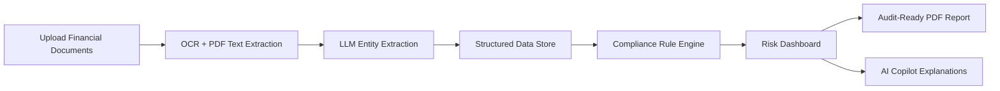
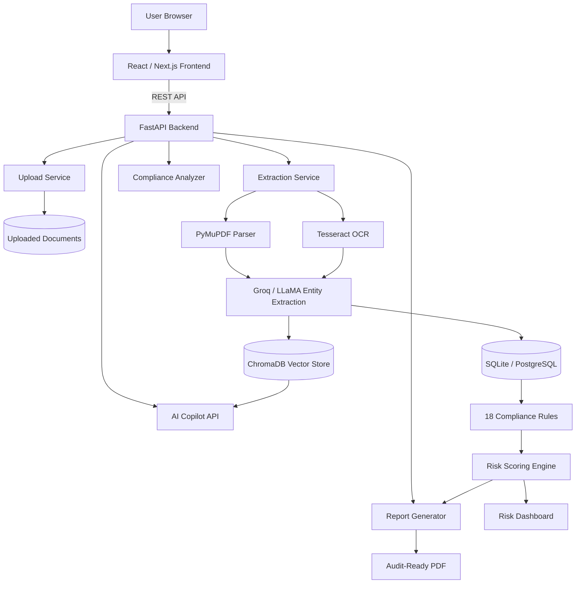
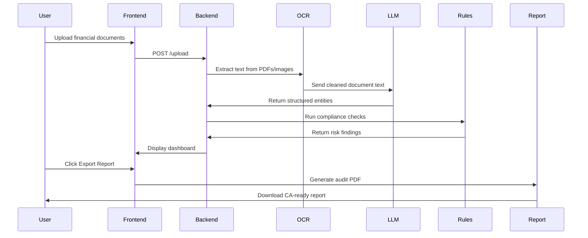
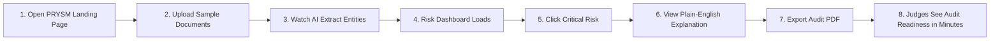
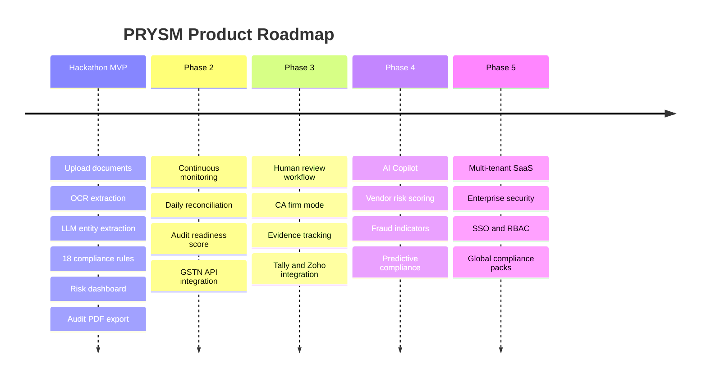

<div align="center">


<br />


<br />

<p>
  
  
  
  
</p>

<h3>“Know your audit gaps before the auditor does.”</h3>

<p>
  <b>PRYSM</b> is an AI-powered audit intelligence platform that helps finance teams, CFOs, CA firms, and SMEs detect compliance gaps, reconciliation mismatches, missing invoices, and audit risks before they become expensive problems.
</p>

</div>

---

## 🚀 One-Line Pitch

**PRYSM transforms manual audit preparation from weeks of document checking into minutes of AI-powered compliance intelligence.**

---

## 🧠 Problem Statement

Audit preparation is slow, expensive, and reactive.

Finance teams often spend weeks collecting invoices, GST returns, bank statements, ROC filings, and supporting documents. Critical issues such as GST mismatches, missing invoices, late filings, or unmatched bank entries are usually discovered too late — during the audit itself.

This leads to:

- Delayed audit readiness
- High CA preparation costs
- Missed compliance gaps
- Penalties and interest exposure
- Poor document traceability
- Last-minute finance team stress

> Businesses should not discover audit risks only when the auditor arrives.

---

## 💡 Solution Overview

**PRYSM** acts as a continuous audit intelligence layer.

Users upload financial documents. PRYSM extracts structured entities using OCR and LLMs, runs deterministic compliance checks, detects gaps, explains risks in plain English, and generates a professional audit-ready PDF report.



---

## ✨ Key Features

| Feature | Description |
|---|---|
| 📤 AI Document Upload Portal | Upload invoices, GST returns, bank statements, ROC filings, and scanned PDFs |
| 🔍 PDF + OCR Extraction | Uses PyMuPDF and Tesseract to extract text from native and scanned documents |
| 🧠 LLM Entity Extraction | Extracts GSTIN, invoice number, dates, amounts, HSN codes, vendor names, and tax details |
| ⚖️ Compliance Rule Engine | Runs 18 deterministic audit and compliance rules |
| 🧾 GST Mismatch Detection | Compares invoice data, GST returns, and extracted values |
| 🚨 Missing Invoice Detection | Detects invoice sequence gaps and missing financial records |
| 📊 Risk Dashboard | Displays Critical, High, Medium, and Low severity findings |
| 🤖 AI Copilot | Explains every risk in plain English for CFOs, founders, and finance teams |
| 📑 Audit PDF Reports | Generates CA-ready audit reports with evidence and remediation steps |
| 🧬 ChromaDB Search | Enables semantic search and document intelligence across uploaded files |

---

## 🛠️ Tech Stack

<div align="center">

### Frontend


### Backend


### AI + Document Intelligence


### Deployment


</div>

---

## 🏗️ System Architecture



---

## 🔄 PRYSM Workflow



---

## 🎬 Demo Preview

> Replace these placeholders with your actual project GIFs/screenshots.

| Landing Page | Risk Dashboard |
|---|---|
|  |  |

| AI Extraction | Audit Report |
|---|---|
|  |  |

---

## ⚙️ Installation Guide

### 1. Clone the Repository

```bash
git clone https://github.com/your-username/prysm.git
cd prysm
```

---

## 🧩 Backend Setup

```bash
cd backend
python -m venv venv
```

### Activate Virtual Environment

#### Windows

```bash
venv\Scripts\activate
```

#### macOS / Linux

```bash
source venv/bin/activate
```

### Install Dependencies

```bash
pip install -r requirements.txt
```

### Run Backend Server

```bash
uvicorn app.main:app --reload
```

Backend will run on:

```bash
http://localhost:8000
```

API docs will be available at:

```bash
http://localhost:8000/docs
```

---

## 🎨 Frontend Setup

```bash
cd frontend
npm install
npm run dev
```

Frontend will run on:

```bash
http://localhost:3000
```

---

## 🔐 Environment Variables

Create a `.env` file inside the backend folder:

```env
GROQ_API_KEY=your_groq_api_key
DATABASE_URL=sqlite:///./prysm.db
CHROMA_DB_PATH=./chroma_db
UPLOAD_DIR=./uploads
REPORT_DIR=./reports
```

Create a `.env.local` file inside the frontend folder:

```env
NEXT_PUBLIC_API_URL=http://localhost:8000
```

---

## 📡 API Endpoints

| Method | Endpoint | Description |
|---|---|---|
| `GET` | `/health` | Check backend server health |
| `POST` | `/upload` | Upload financial documents |
| `POST` | `/extract` | Extract text and entities from uploaded documents |
| `POST` | `/analyze` | Run compliance rules and generate risks |
| `GET` | `/risks/{doc_id}` | Fetch risk findings for a document |
| `POST` | `/copilot` | Ask AI Copilot questions about audit risks |
| `GET` | `/report/{doc_id}` | Generate and download audit-ready PDF report |

---

## 📁 Project Structure

```bash
PRYSM/
│
├── backend/
│   ├── app/
│   │   ├── main.py
│   │   ├── routers/
│   │   │   ├── upload.py
│   │   │   ├── extract.py
│   │   │   ├── analyze.py
│   │   │   ├── risks.py
│   │   │   └── report.py
│   │   │
│   │   ├── services/
│   │   │   ├── pdf_parser.py
│   │   │   ├── ocr_service.py
│   │   │   ├── llm_extractor.py
│   │   │   ├── compliance_engine.py
│   │   │   ├── risk_scoring.py
│   │   │   └── report_generator.py
│   │   │
│   │   ├── models/
│   │   │   ├── document.py
│   │   │   ├── entity.py
│   │   │   └── risk.py
│   │   │
│   │   ├── core/
│   │   │   ├── config.py
│   │   │   └── database.py
│   │   │
│   │   └── rules/
│   │       └── rules.json
│   │
│   ├── requirements.txt
│   └── README.md
│
├── frontend/
│   ├── app/
│   ├── components/
│   │   ├── UploadPortal.tsx
│   │   ├── RiskDashboard.tsx
│   │   ├── RiskCard.tsx
│   │   ├── CopilotPanel.tsx
│   │   └── ReportViewer.tsx
│   │
│   ├── public/
│   ├── package.json
│   └── README.md
│
├── docs/
│   ├── architecture.md
│   ├── api-contract.md
│   └── demo-script.md
│
├── tests/
│   ├── backend/
│   └── frontend/
│
└── README.md
```

---

## 🧪 Demo Flow for Judges



### Judge Demo Script

| Step | Action | What Judges See |
|---|---|---|
| 1 | Open PRYSM | Premium fintech-style landing page |
| 2 | Upload documents | Invoice, GST return, bank statement upload |
| 3 | Run extraction | GSTIN, invoice number, dates, amounts appear |
| 4 | View dashboard | Critical and High risks highlighted |
| 5 | Open risk details | Evidence, explanation, and remediation steps |
| 6 | Ask AI Copilot | Plain-English answer about the compliance issue |
| 7 | Export report | Professional audit-ready PDF download |
| 8 | Closing line | “Know your audit gaps before the auditor does.” |

---

## 👥 Team Ragnarok

| Member | Role | Responsibility |
|---|---|---|
| **Shreekumar** | Team Lead / System Architect | Architecture, integration, backend design, demo strategy |
| **Santheesh** | Backend Lead | FastAPI, OCR pipeline, database, compliance engine |
| **Tharun BL** | Frontend Lead | React / Next.js UI, dashboard, upload portal, UX |
| **Vishal** | Research Lead | GST rules, compliance logic, prompt engineering |
| **Sharun** | Testing & CI/CD Lead | Testing, deployment, QA, CI/CD pipeline |

---

## 🛣️ Roadmap



---

## 🧠 Future Enhancements

- Multi-agent audit workflow
- Human-in-the-loop compliance review
- Tally and Zoho Books integration
- GSTN API integration
- Vendor risk scoring
- Fraud pattern detection
- Multi-client CA firm dashboard
- Enterprise RBAC and SSO
- Continuous audit readiness monitoring
- Predictive compliance alerts

---

## 🏆 Why PRYSM Stands Out

PRYSM is not just another document parser.

It combines:

- **AI extraction** for speed
- **Deterministic rules** for trust
- **Risk scoring** for prioritization
- **Plain-English explanations** for clarity
- **Audit-ready reports** for real-world usability

> PRYSM does not replace auditors.  
> It makes every finance team audit-ready before the auditor arrives.

---

## 📜 License

This project is licensed under the **MIT License**.

```text
MIT License

Copyright (c) 2026 Team Ragnarok

Permission is hereby granted, free of charge, to any person obtaining a copy
of this software and associated documentation files, to deal in the Software
without restriction, including without limitation the rights to use, copy,
modify, merge, publish, distribute, sublicense, and/or sell copies of the Software.
```

---

<div align="center">


<h2>PRYSM</h2>

<h3>Know your audit gaps before the auditor does.</h3>

<p>
  <b>Built with dedication by Team Ragnarok.</b>
</p>

</div>
